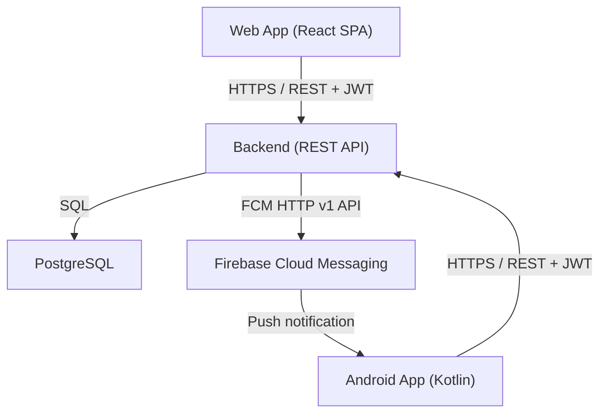

# Design Document: Система учёта личного состава

## Overview

Система учёта личного состава — трёхзвенное веб-приложение с мобильным Android-клиентом. Система решает три ключевые задачи:

1. **Расход личного состава** — руководитель дважды в сутки (09:00 / 21:00) фиксирует статус каждого сотрудника подразделения.
2. **Тревога** — руководитель одним нажатием рассылает push-уведомление всем сотрудникам; система отслеживает подтверждения в реальном времени.
3. **Администрирование** — администратор управляет справочниками (должности, звания, подразделения) и учётными записями.

Система состоит из трёх компонентов:
- **Backend** — REST API (Node.js / Express или аналог), PostgreSQL, интеграция с Firebase Cloud Messaging.
- **Web App** — SPA (React) для ролей «admin» и «commander».
- **Android App** — нативное Android-приложение для роли «employee».

---

## Architecture



### Ключевые архитектурные решения

- **Stateless JWT-аутентификация**: access-токен (короткоживущий, ~15 мин) + refresh-токен (долгоживущий, ~7 дней). Refresh-токены хранятся в БД для возможности отзыва.
- **Обновление статусов тревоги**: Web App опрашивает Backend каждые 10 секунд (polling) или использует WebSocket — выбор определяется на этапе реализации. Polling проще в развёртывании; WebSocket снижает задержку.
- **FCM-токены**: Android App регистрирует FCM-токен при каждом входе; токен хранится в таблице `employees` (поле `fcm_token`).
- **Offline-подтверждение тревоги**: Android App сохраняет ответ в локальной SQLite/Room БД и отправляет при восстановлении сети.

---

## Components and Interfaces

### Backend REST API

#### Аутентификация

| Метод | Путь | Роль | Описание |
|-------|------|------|----------|
| POST | `/api/auth/login` | any | Вход, возврат JWT пары |
| POST | `/api/auth/refresh` | any | Обновление токенов |
| POST | `/api/auth/logout` | any | Выход, фиксация `date_time_out` |

#### Справочники (Admin)

| Метод | Путь | Роль | Описание |
|-------|------|------|----------|
| GET/POST | `/api/users` | admin | Список / создание пользователей |
| GET/PUT/DELETE | `/api/users/:id` | admin | Чтение / обновление / удаление |
| GET/POST | `/api/employees` | admin | Список / создание сотрудников |
| GET/PUT/DELETE | `/api/employees/:id` | admin | Чтение / обновление / удаление |
| GET/POST/PUT/DELETE | `/api/positions` | admin | CRUD должностей |
| GET/POST/PUT/DELETE | `/api/ranks` | admin | CRUD званий |
| GET/POST/PUT/DELETE | `/api/units` | admin | CRUD подразделений |
| GET/POST/PUT/DELETE | `/api/user-statuses` | admin | CRUD статусов |

Все списочные эндпоинты поддерживают параметры `?page=1&page_size=20`.

#### Расход (Commander)

| Метод | Путь | Роль | Описание |
|-------|------|------|----------|
| GET | `/api/raskhod` | commander | История расходов подразделения |
| POST | `/api/raskhod` | commander | Создание расхода |
| GET | `/api/raskhod/:id` | commander | Детали расхода |

#### Тревога (Commander / Employee)

| Метод | Путь | Роль | Описание |
|-------|------|------|----------|
| POST | `/api/alerts` | commander | Объявить тревогу |
| GET | `/api/alerts/:id/responses` | commander | Список откликов |
| POST | `/api/alerts/:id/respond` | user | Подтвердить получение |

#### FCM-токен (Employee)

| Метод | Путь | Роль | Описание |
|-------|------|------|----------|
| PUT | `/api/employees/me/fcm-token` | user | Обновить FCM-токен |

### Web App (React SPA)

Маршруты:
- `/login` — страница входа
- `/admin/*` — административная панель (только admin)
- `/raskhod` — форма расхода (только commander)
- `/raskhod/history` — история расходов
- `/alerts` — панель тревоги (только commander)

### Android App

Компоненты:
- `LoginActivity` — вход, регистрация FCM-токена
- `FCMService` (extends `FirebaseMessagingService`) — приём push, воспроизведение звука, показ уведомления
- `AlertNotificationActivity` — кнопка «Принял»
- `OfflineQueue` (Room + WorkManager) — очередь отложенных ответов

---

## Data Models

### Схема базы данных (PostgreSQL)

```sql
-- Роли
CREATE TABLE roles (
    id   SERIAL PRIMARY KEY,
    name VARCHAR(50) NOT NULL UNIQUE  -- 'user', 'admin', 'commander'
);

-- Пользователи
CREATE TABLE users (
    id            SERIAL PRIMARY KEY,
    login         VARCHAR(100) NOT NULL UNIQUE,
    password_hash VARCHAR(255) NOT NULL,
    role_id       INTEGER NOT NULL REFERENCES roles(id)
);

-- Статусы присутствия
CREATE TABLE user_statuses (
    id   SERIAL PRIMARY KEY,
    name VARCHAR(100) NOT NULL UNIQUE
    -- 'налицо', 'болен', 'наряд', 'командировка', 'отпуск', 'незаконно отсутствует'
);

-- Справочники
CREATE TABLE positions (
    id   SERIAL PRIMARY KEY,
    name VARCHAR(200) NOT NULL UNIQUE
);

CREATE TABLE ranks (
    id   SERIAL PRIMARY KEY,
    name VARCHAR(200) NOT NULL UNIQUE
);

CREATE TABLE units (
    id   SERIAL PRIMARY KEY,
    name VARCHAR(200) NOT NULL UNIQUE
);

-- Сотрудники
CREATE TABLE employees (
    id           SERIAL PRIMARY KEY,
    user_id      INTEGER REFERENCES users(id),
    last_name    VARCHAR(100) NOT NULL,
    first_name   VARCHAR(100) NOT NULL,
    middle_name  VARCHAR(100),
    position_id  INTEGER REFERENCES positions(id),
    rank_id      INTEGER REFERENCES ranks(id),
    birth_date   DATE,
    unit_id      INTEGER NOT NULL REFERENCES units(id),
    phone_number VARCHAR(20),
    fcm_token    VARCHAR(255)  -- FCM registration token
);

-- Журнал аудита
CREATE TABLE audit_log (
    id            SERIAL PRIMARY KEY,
    user_id       INTEGER NOT NULL REFERENCES users(id),
    date_time_in  TIMESTAMPTZ NOT NULL,
    date_time_out TIMESTAMPTZ
);

-- Расход
CREATE TABLE raskhod (
    id                 SERIAL PRIMARY KEY,
    raskhod_time       TIME NOT NULL,        -- 09:00 или 21:00
    raskhod_date       DATE NOT NULL,
    created_by_user_id INTEGER NOT NULL REFERENCES users(id),
    unit_id            INTEGER NOT NULL REFERENCES units(id),
    UNIQUE (raskhod_date, raskhod_time, unit_id)
);

-- Записи расхода
CREATE TABLE raskhod_entries (
    id          SERIAL PRIMARY KEY,
    raskhod_id  INTEGER NOT NULL REFERENCES raskhod(id),
    employee_id INTEGER NOT NULL REFERENCES employees(id),
    status_id   INTEGER NOT NULL REFERENCES user_statuses(id)
);

-- Тревоги
CREATE TABLE alerts (
    id                 SERIAL PRIMARY KEY,
    created_by_user_id INTEGER NOT NULL REFERENCES users(id),
    created_at         TIMESTAMPTZ NOT NULL DEFAULT NOW(),
    unit_id            INTEGER NOT NULL REFERENCES units(id)
);

-- Отклики на тревогу
CREATE TABLE alert_responses (
    id           SERIAL PRIMARY KEY,
    alert_id     INTEGER NOT NULL REFERENCES alerts(id),
    employee_id  INTEGER NOT NULL REFERENCES employees(id),
    responded_at TIMESTAMPTZ NOT NULL,
    UNIQUE (alert_id, employee_id)
);
```

### JWT Payload

```json
{
  "sub": "<user_id>",
  "role": "admin | commander | user",
  "unit_id": "<unit_id>",
  "iat": 1700000000,
  "exp": 1700000900
}
```

### API Response Envelope

```json
{
  "data": { ... },
  "meta": { "page": 1, "page_size": 20, "total": 150 }
}
```

---

## Correctness Properties

*A property is a characteristic or behavior that should hold true across all valid executions of a system — essentially, a formal statement about what the system should do. Properties serve as the bridge between human-readable specifications and machine-verifiable correctness guarantees.*

