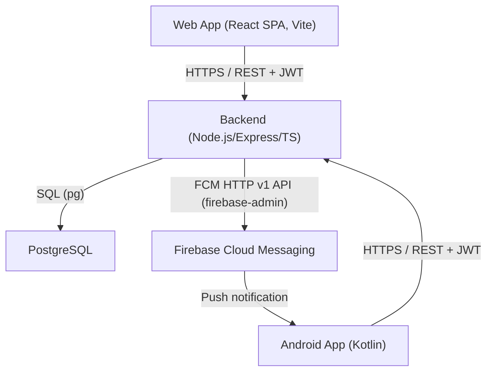

# Design Document: Система учёта личного состава

## Overview

Система учёта личного состава — трёхзвенное веб-приложение с мобильным Android-клиентом. Система решает три ключевые задачи:

1. **Расход личного состава** — руководитель дважды в сутки (09:00 / 21:00) фиксирует статус каждого сотрудника подразделения.
2. **Тревога** — руководитель одним нажатием рассылает push-уведомление всем сотрудникам; система отслеживает подтверждения в реальном времени.
3. **Администрирование** — администратор управляет личным составом (сотрудники + учётные записи), справочниками (должности, звания, подразделения, статусы) и просматривает журнал входов.

Система состоит из трёх компонентов:
- **Backend** — REST API на Node.js / Express / TypeScript, PostgreSQL, интеграция с Firebase Cloud Messaging (FCM HTTP v1 API).
- **Web App** — SPA на React + TypeScript (сборка Vite) для ролей «admin» и «commander».
- **Android App** — нативное Android-приложение на Kotlin для роли «employee» (Retrofit, OkHttp, Firebase Messaging, Room, WorkManager).

---

## Architecture



### Ключевые архитектурные решения

- **Stateless JWT-аутентификация**: access-токен (~15 мин) + refresh-токен (~7 дней). Refresh-токены хранятся в таблице `refresh_tokens` для возможности отзыва (rotation — старый удаляется при выдаче нового).
- **Определение unit_id**: `COALESCE(employees.unit_id, users.unit_id)` — позволяет командиру работать даже без записи в `employees`.
- **Обновление статусов тревоги**: Web App опрашивает Backend каждые 10 секунд (polling). Идентификатор активной тревоги сохраняется в `localStorage` для устойчивости к перезагрузке страницы.
- **FCM-токены**: Android App регистрирует FCM-токен при каждом входе; токен хранится в таблице `employees` (поле `fcm_token`).
- **Offline-подтверждение тревоги**: Android App сохраняет ответ в Room БД и отправляет при восстановлении сети через WorkManager.
- **Генерация документов**: Сервер генерирует DOCX-файлы расхода через библиотеку `docx`.

---

## Components and Interfaces

### Backend REST API

#### Аутентификация

| Метод | Путь | Роль | Описание |
|-------|------|------|----------|
| POST | `/api/auth/login` | any | Вход: JWT пара + запись в `audit_log` |
| POST | `/api/auth/refresh` | any | Обновление токенов (rotation) |
| POST | `/api/auth/logout` | any | Выход: фиксация `date_time_out`, удаление refresh-токена |

#### Личный состав и справочники (Admin)

| Метод | Путь | Роль | Описание |
|-------|------|------|----------|
| GET/POST | `/api/users` | admin | Список / создание пользователей |
| GET/PUT/DELETE | `/api/users/:id` | admin | Чтение / обновление / удаление пользователя |
| GET/POST | `/api/employees` | admin | Список (`?unit_id=X`) / создание сотрудников |
| GET/PUT/DELETE | `/api/employees/:id` | admin | Чтение / обновление / удаление сотрудника |
| GET/POST/PUT/DELETE | `/api/positions` | admin | CRUD должностей |
| GET/POST/PUT/DELETE | `/api/ranks` | admin | CRUD званий |
| GET/POST/PUT/DELETE | `/api/units` | admin | CRUD подразделений |
| GET/POST/PUT/DELETE | `/api/user-statuses` | admin | CRUD статусов |
| GET | `/api/roles` | admin | Список ролей (только чтение) |
| GET | `/api/audit-log` | admin | Журнал входов/выходов |

Все списочные эндпоинты поддерживают параметры `?page=1&page_size=20`.

#### Профиль и данные подразделения (Employee / Commander)

| Метод | Путь | Роль | Описание |
|-------|------|------|----------|
| GET | `/api/employees/me` | any auth | Профиль текущего сотрудника (ФИО, звание, должность, подразделение) |
| GET | `/api/employees/unit` | commander | Список сотрудников подразделения командира |
| GET | `/api/employees/statuses` | commander | Список статусов для формы расхода |
| PUT | `/api/employees/me/fcm-token` | user | Обновить FCM-токен |

#### Расход (Commander)

| Метод | Путь | Роль | Описание |
|-------|------|------|----------|
| GET | `/api/raskhod` | commander | История расходов подразделения |
| POST | `/api/raskhod` | commander | Создание расхода |
| GET | `/api/raskhod/:id` | commander | Детали расхода |
| PUT | `/api/raskhod/:id` | commander | Редактирование записей расхода |
| DELETE | `/api/raskhod/:id` | commander | Удаление расхода |
| GET | `/api/raskhod/:id/download` | commander | Скачивание расхода в формате DOCX |

#### Тревога (Commander / Employee)

| Метод | Путь | Роль | Описание |
|-------|------|------|----------|
| GET | `/api/alerts` | commander | История тревог подразделения (с пагинацией) |
| POST | `/api/alerts` | commander | Объявить тревогу (+ отправка FCM) |
| GET | `/api/alerts/:id/responses` | commander | Список откликов на тревогу |
| POST | `/api/alerts/:id/respond` | user | Подтвердить получение сигнала |

#### Служебные

| Метод | Путь | Роль | Описание |
|-------|------|------|----------|
| GET | `/health` | any | Проверка работоспособности сервера |

### Web App (React SPA)

Маршруты:
- `/login` — страница входа
- `/admin` — административная панель (только admin), редирект на `/admin/roster`
  - `/admin/roster` — Личный состав (единая страница: выбор подразделения → сотрудники)
  - `/admin/users` — Учётные записи (прямое управление аккаунтами, включая создание admin)
  - `/admin/employees` — Сотрудники (legacy-страница)
  - `/admin/positions` — Должности
  - `/admin/ranks` — Звания
  - `/admin/units` — Подразделения
  - `/admin/user-statuses` — Статусы
  - `/admin/audit-log` — Журнал входов
- `/raskhod` — форма расхода (только commander)
- `/raskhod/history` — история расходов (двухколоночный интерфейс с поиском, фильтрами, редактированием, скачиванием DOCX и удалением)
- `/alerts` — панель тревоги (только commander)
- `/alerts/history` — история тревог (двухпанельный интерфейс с поиском и фильтрами)

Компоненты навигации:
- `CommanderNav` — единая навигационная панель для всех страниц командира (Тревога, История тревог, Расход, История расходов, Выход)
- `AdminPage` sidebar — боковое меню для всех страниц администратора

### Android App

Компоненты:
- `LoginActivity` — вход, регистрация FCM-токена
- `HomeActivity` — главный экран: профиль сотрудника (ФИО, звание, должность, подразделение), кнопка выхода
- `MyFirebaseMessagingService` (extends `FirebaseMessagingService`) — приём push, запуск `AlarmPlayerService`
- `AlarmPlayerService` — foreground service, воспроизведение системного alarm tone
- `AlertActivity` — полноэкранная активность тревоги с кнопкой «Принял»
- `AlertResponseQueue` / `AlertSyncWorker` (Room + WorkManager) — очередь отложенных ответов при offline
- `MainApplication` — инициализация Room БД
- `RefreshTokenAuthenticator` / `AuthHeaderInterceptor` (OkHttp) — автоматическое обновление JWT

---

## Data Models

### Схема базы данных (PostgreSQL)

```sql
-- Роли
CREATE TABLE roles (
    id   SERIAL PRIMARY KEY,
    name VARCHAR(50) NOT NULL UNIQUE  -- 'user', 'admin', 'commander'
);

-- Пользователи
CREATE TABLE users (
    id             SERIAL PRIMARY KEY,
    login          VARCHAR(100) NOT NULL UNIQUE,
    password_hash  VARCHAR(255) NOT NULL,
    role_id        INTEGER NOT NULL REFERENCES roles(id),
    unit_id        INTEGER REFERENCES units(id)
);

-- Статусы присутствия
CREATE TABLE user_statuses (
    id   SERIAL PRIMARY KEY,
    name VARCHAR(100) NOT NULL UNIQUE
);

-- Справочники
CREATE TABLE positions (
    id   SERIAL PRIMARY KEY,
    name VARCHAR(200) NOT NULL UNIQUE
);

CREATE TABLE ranks (
    id   SERIAL PRIMARY KEY,
    name VARCHAR(200) NOT NULL UNIQUE
);

CREATE TABLE units (
    id   SERIAL PRIMARY KEY,
    name VARCHAR(200) NOT NULL UNIQUE
);

-- Сотрудники
CREATE TABLE employees (
    id           SERIAL PRIMARY KEY,
    user_id      INTEGER UNIQUE REFERENCES users(id) ON DELETE SET NULL,
    last_name    VARCHAR(100) NOT NULL,
    first_name   VARCHAR(100) NOT NULL,
    middle_name  VARCHAR(100),
    position_id  INTEGER REFERENCES positions(id),
    rank_id      INTEGER REFERENCES ranks(id),
    birth_date   DATE,
    unit_id      INTEGER NOT NULL REFERENCES units(id),
    phone_number VARCHAR(20),
    fcm_token    VARCHAR(255)
);

-- Журнал аудита
CREATE TABLE audit_log (
    id            SERIAL PRIMARY KEY,
    user_id       INTEGER NOT NULL REFERENCES users(id),
    date_time_in  TIMESTAMPTZ NOT NULL,
    date_time_out TIMESTAMPTZ
);

-- Refresh-токены
CREATE TABLE refresh_tokens (
    id         SERIAL PRIMARY KEY,
    user_id    INTEGER NOT NULL REFERENCES users(id) ON DELETE CASCADE,
    token      VARCHAR(500) NOT NULL,
    expires_at TIMESTAMPTZ NOT NULL,
    created_at TIMESTAMPTZ DEFAULT NOW()
);

-- Расход
CREATE TABLE raskhod (
    id                 SERIAL PRIMARY KEY,
    raskhod_time       TIME NOT NULL,
    raskhod_date       DATE NOT NULL,
    created_by_user_id INTEGER NOT NULL REFERENCES users(id),
    unit_id            INTEGER NOT NULL REFERENCES units(id),
    UNIQUE (raskhod_date, raskhod_time, unit_id)
);

-- Записи расхода
CREATE TABLE raskhod_entries (
    id          SERIAL PRIMARY KEY,
    raskhod_id  INTEGER NOT NULL REFERENCES raskhod(id),
    employee_id INTEGER NOT NULL REFERENCES employees(id),
    status_id   INTEGER NOT NULL REFERENCES user_statuses(id),
    UNIQUE (raskhod_id, employee_id)
);

-- Тревоги
CREATE TABLE alerts (
    id                 SERIAL PRIMARY KEY,
    created_by_user_id INTEGER NOT NULL REFERENCES users(id),
    created_at         TIMESTAMPTZ NOT NULL DEFAULT NOW(),
    unit_id            INTEGER NOT NULL REFERENCES units(id)
);

-- Отклики на тревогу
CREATE TABLE alert_responses (
    id           SERIAL PRIMARY KEY,
    alert_id     INTEGER NOT NULL REFERENCES alerts(id),
    employee_id  INTEGER NOT NULL REFERENCES employees(id),
    responded_at TIMESTAMPTZ NOT NULL,
    UNIQUE (alert_id, employee_id)
);
```

### JWT Payload

```json
{
  "sub": "<user_id>",
  "role": "admin | commander | user",
  "unit_id": "<unit_id>",
  "iat": 1700000000,
  "exp": 1700000900
}
```

### API Response Envelope

```json
{
  "data": { ... },
  "meta": { "page": 1, "page_size": 20, "total": 150 }
}
```

---

## Correctness Properties

*A property is a characteristic or behavior that should hold true across all valid executions of a system — essentially, a formal statement about what the system should do. Properties serve as the bridge between human-readable specifications and machine-verifiable correctness guarantees.*
