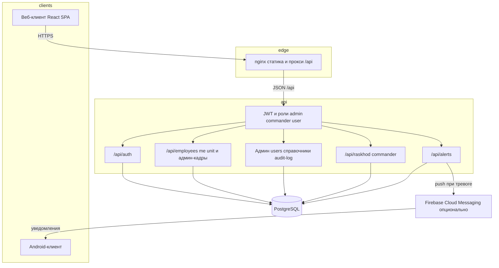
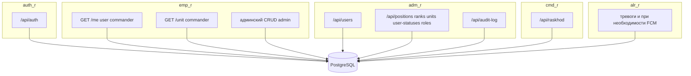
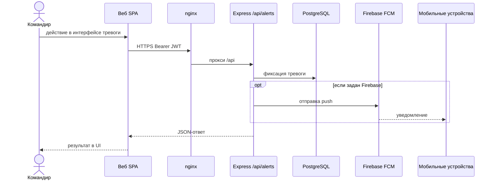
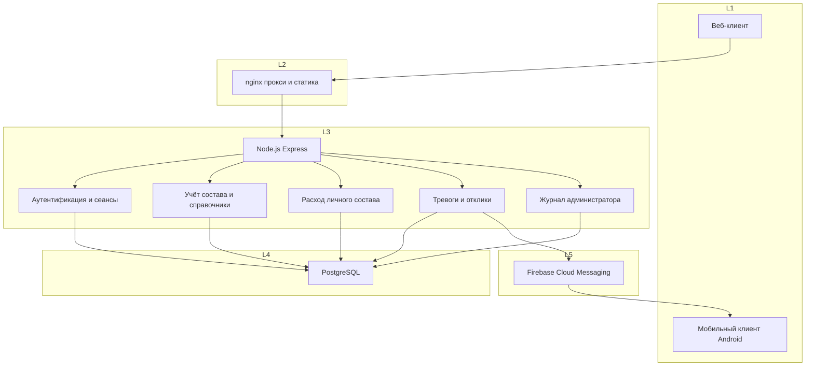
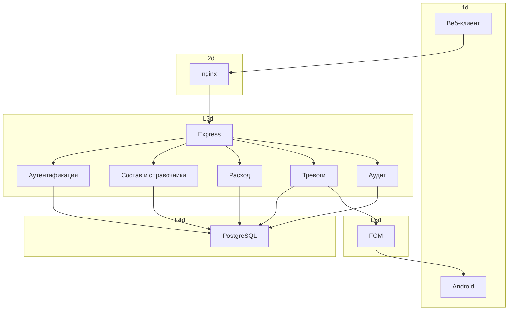
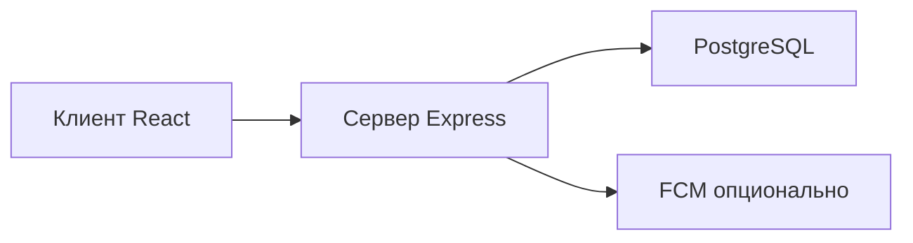
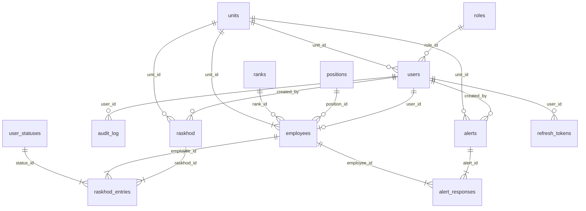

# Диаграммы и схемы проекта diplom_signal (Mermaid)

## Важно для Kroki.io (иначе Error 400 / No diagram type detected)

В поле ввода Kroki должна попасть **только** строка с типом диаграммы: первая значащая строка — `graph TB`, `flowchart TB`, `sequenceDiagram`, `erDiagram` и т.д.

**Нельзя** вставлять:

- строку `` ```mermaid``
- закрывающие `` ``` ``
- весь блок Markdown целиком

Если Kroki пишет **`No diagram type detected`** и в тексте ошибки видно начало вроде `` `mermaid flowchart`` — вы всё ещё вставили **ограждение** или склеили слово `mermaid` с `flowchart`/`graph`. Допустимое начало вставки: **`graph TB`**, **`sequenceDiagram`**, **`erDiagram`** (первая строка кода диаграммы).

**Как копировать из этого файла:** откройте блок под заголовком раздела, выделите текст **от первой строки внутри блока** (`graph…` / `sequenceDiagram` / `erDiagram`) **до строки перед** закрывающими `` ``` `` (**три кавычки в конце не копируйте**). Вставьте в Kroki только это.

Один запрос Kroki = **одна** диаграмма. POST: `https://kroki.io/mermaid/svg`, тело — UTF-8 plain text **без** Markdown-ограждений.

**PowerShell** (сохраните **одну** скопированную диаграмму в файл, например `docs/_kroki-input.mmd`):

```powershell
$body = Get-Content .\docs\_kroki-input.mmd -Raw -Encoding UTF8
Invoke-WebRequest -Uri "https://kroki.io/mermaid/svg" -Method Post -Body $body `
  -ContentType "text/plain; charset=utf-8" -OutFile .\docs\diagram.svg -UseBasicParsing
```

PNG: в URI замените `/mermaid/svg` на `/mermaid/png`.

**Локально:** `npx --yes @mermaid-js/mermaid-cli -i docs/_kroki-input.mmd -o docs/diagram.svg`

Текстовое описание полей БД без Mermaid: [`database-schema.md`](database-schema.md).

---

## 1. Архитектура системы (клиенты, nginx, API, БД, FCM)



---

## 2. Группы HTTP-маршрутов и хранилище

Соответствует `backend/src/index.ts`.



---

## 3. Поток объявления тревоги и push



---

## 4. Диплом: логико-функциональная архитектура (уровни L1–L5)

Синтаксис совместим со старым Mermaid: `graph`, `subgraph` без заголовка в скобках, только `-->`.



Подпись к рисунку: **L1** пользователи, **L2** представление, **L3** прикладная логика, **L4** данные, **L5** внешний сервис.

---

## 5. Диплом: краткие подписи (та же топология)



---

## 6. Диплом: композиция компонентов



---

## 7. Схема связей сущностей БД (ER)

Упрощённо; типы и поля см. `database-schema.md`.



---

## Подписи к рисункам (примеры)

- **Рисунок N** — Архитектура программного средства учёта личного состава.
- **Рисунок N+1** — Группы маршрутов API и СУБД.
- **Рисунок N+2** — Диаграмма последовательности: объявление тревоги и доставка уведомлений.
